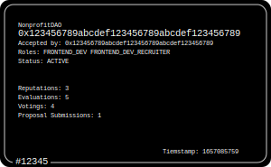

## Nonprofit DAO

**Non-profit DAO is a reputation-based DAO framework for the Ethereum blockchain**

Non-profit DAO consists of:

- [**SBRTManager**](./src/SBRTManager.sol)
- [**GovernorNPO**](./src/GovernorNPO.sol)

**SBRT (Soulbound Reputation Token) example**

  

